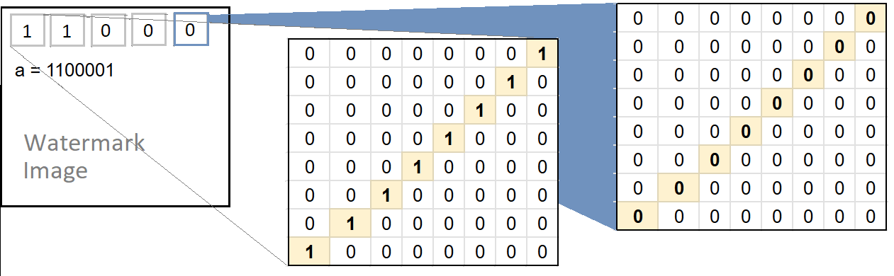
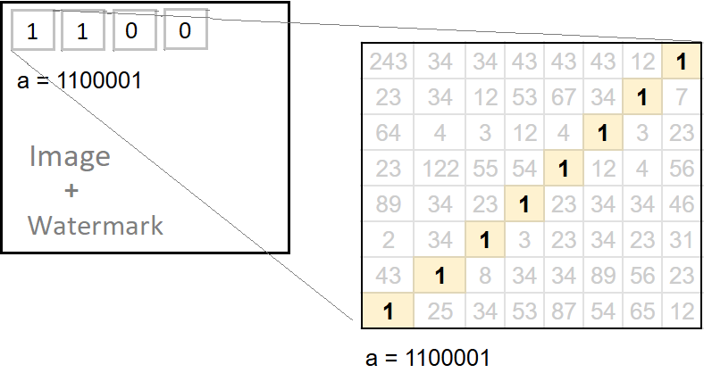
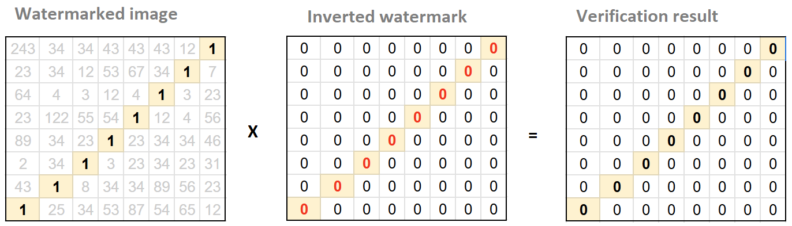

# Image Watermarking Using Fully Homomorphic Encryption
Invisible image watermarking is a technique used to embed hidden information within digital images without visibly altering their appearance. There are many applications for this technique, but main one is to prove ownership. 

At the moment, there are many services for invisible watermarking, but none of them allows users to do it privately.

Our goal was to create a service that can perform invisible watermarking and watermark verification on encrypted images using FHE.

## Invesible Watermarking 
By watermarking we mean the process of introducing some hidden information into an image. Where is the hidden information is our watermark. As a result, the overall algorithm consists of two parts - the creation of a watermark (mask) and the process of embedding the watermark into the image.

To avoid image artifacts after watermark embedding, we use **discrete cosine transform (DCT)** before embedding. And inverse DCT after embedding.

Common algorithm steps:
1. Encode the original image using DCT
2. Create a watermark mask using
3. Embed mask into original (DCT-encoded) image
4. Decode watermarked image using inverse DCT

### Watermark mask creation
A **watermark mask** is an empty image (with the same shape as the chosen channel of the original image) that contains only the encoded **watermark data** (hash of watermark text). 

We use the following approach to encode data into the mask:
1. Encode each letter of watermark data using ASCII code to create **watermark bits**
2. Divide the mask into 8x8 pixel blocks
3. For each block replace reverse diagonal with the value of coresponding watermark bit

> We use the inverse diagonal because it represents the midrange frequencies of the DCT. Midrange frequencies introduce less distortion into the image and are more resistant to influences (filters, compression) than high frequencies.

As a result, every 8 blocks contain 1 letter of watermark data in ASCII encoding.

### Watermark mask embedding
Essentially, we add two images together, after erasing the reverse diagonals in each block of the original image channel.

1. Image preparing: place zero values ​​in the inverse diagonal of the each block
2. Add the two arrays - the dct encoded channel and the watermark mask.

The result looks like below. Where white cells are the pixels of the original image, yellow cells are the pixels of the watermark mask.

### Results
PSNR - one of the main metrics used to compare the quality of watermarking algorithms

We took 5 different images and embedded 10 different text in each of images.
The table below shows the average PSNR value for each image.

|  | Coala | Philosopher | Robot | Salmon | Space | 
|----------------|----------------| ---------| ---------| ---------| ----|
| PSNR | 43.6 | 40.2 | 41.3 | 38.9 | 49 |

Average score grater than 40 is a good result, comparable to other watermarking algorithms.

## Verification 

To describe the verification algorithm, we need to introduce a new definition, such as **inverted watermark mask**.

The inverted watermark mask contains the same data as the standard watermark mask, but each 8x8 pixel block has inverted watermark data on the reverse diagonal.

The basic idea of ​​the werification test is that if an image has a watermark mask embedded, then the Hadamard product of the image and the inverted watermark mask is zero. The number of non-zero elements indicates the level of error.

### Algoritm

Common algorithm steps:
1. Encode the tested image using DCT
2. Create an inverted watermark mask
3. Perform *Hadamard product** of the image channel and inverted watermark mask
4. Compare results with small number (if score is less than theshold than we detected watermark)

_Compare the sum of all values ​​inside the results matrix with zero._

### Results

During our testing fase we did not find any false positive or false negative examples

## Challenges 

### Clear params in functions
Simple case: we compiled python function into fhe circuit and created client and server.
-Server's run method can use as input only encrypted data (fhe.Value).
Even "clear" parameters/inputs should be "encrypted" on Client side.
Because of that, all additional params (of compiled function) has to be sent from the server to the client, which is inconvenient and sometimes unsafe.

Maybe there is a way to keep clear params on server side, but we did not find it.

### Сomparison in compiled function
We wanted from our verification function to produce a prediction rather than a score.
Unfortunately, we were unable to compile a function that uses comparison between encrypted data and const number.
In one github repo we found example with fhe.tag("comparison"), but it did not work for us.

## Final conclusions
This research is a good first step to implement private image watermarking service using FHE.
Check out our HF demo - https://huggingface.co/spaces/horaizon27/fhe_image_watermarking

Next steps:
1) Adding server date to watermark text. To prove ownership, it is enough to show that you had the image earlier than the others and server date can help with that.
2) In the current version, it is relativly easy to forge a watermark. Adding encryption should fix this.
3) We can try another verification algoritm

## Circuit composition
We also experimented with circuit composition, which allows the output of one circuit execution to be used directly as the input for another without decryption. We executed the circuit multiple times by forwarding outputs without decrypting intermediate values. See the code example in composition.ipynb.

## Using the Repository

1) Build docker container using files from **/docker**
2) Clone this repo
3) Run **main.ipynb** (Change constants if needed)
4) Run **composition.ipynb** (In order to see experiment with circuit composition)